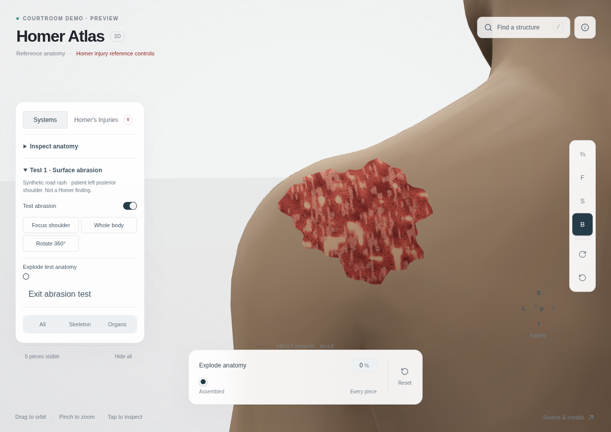

# Test 1 — synthetic shoulder abrasion

Open the atlas with `?test=abrasion`, or use **Layers → Test 1 · Surface abrasion → Start abrasion test**. This is a synthetic capability fixture, not a Homer finding.

The parent is the existing BodyParts3D skin mesh **FJ2810 / FMA7163**. Patient left is +X; posterior is −Z; units are meters. The lesion lies over the left posterior shoulder at approximately X .172, Y 1.397. Its irregular reference-space outline spans roughly 7.7 × 6.6 cm. These are deliberately obvious test dimensions, not a clinical measurement.

## Actual geometry

The implementation clips the original skin triangles against a concave, scalloped 64-point perimeter, producing **483 triangles**. Every vertex is interpolated on an original skin triangle. Maximum measured distance from the parent triangle is **0.0000000565 m**, within float precision. The mesh follows the shoulder's curvature and is not a plane, billboard, sphere, or oval marker. Polygon depth bias prevents coincident-surface flicker without lifting vertices off the skin.

The abrasion geometry is regenerated from the active parent geometry whenever that geometry is replaced. It does not reuse stale vertex or triangle attachments. Its shader samples the exact same GPU part-state texture as its parent, including explosion translation and visibility. The abrasion adds one draw call while enabled.

## Appearance and limits

The existing skin becomes opaque in test mode. Reference-coordinate procedural shading gives the abrasion red/brown variation, directional scrape-like marks, darker speckling, and small skin-colored islands. This shading is synthetic, not photographic reconstruction. The overlay represents superficial surface involvement; it does not invent wound depth, exposed fat, bleeding dynamics, or histological tissue layers. Skin geometry remains unchanged. No new third-party images or meshes were imported. BodyParts3D attribution and CC BY 4.0 credit remain in `public/ATTRIBUTION.md`.

## Controls

- **Focus shoulder**, **Whole body**, and direct orbit/zoom.
- **Rotate 360°** performs a complete turn around the current camera target.
- **Show body surface** hides/restores skin and its abrasion together.
- **Show test abrasion** independently restores clean skin.
- **Explode test anatomy** uses the original atlas's per-part layout and transforms.
- **Exit abrasion test** restores the ordinary atlas.

The default presentation contains no abrasion. The test controls live in Layers; no separate anatomy application was created.

## Verification

`node scripts/validate-abrasion.mjs` checks every overlay vertex against its recorded parent triangle, barycentric containment, patient-left/posterior placement, nonplanarity, and parent indexing. Existing catalogue, inspection, interaction, injury-reference, surface-removal and nested-path validations also pass locally, as do TypeScript and production build.

`scripts/check-abrasion-browser.mjs` exercises the real production bundle under `/courtroom-atlas/`, captures a full rotation video and screenshots, and checks visible abrasion pixels, rotation, zoom, skin off/on, explosion, and clean skin. Browser-run results and visual review are recorded with the PR. These are CI software-rendering tests, not a physical-device performance claim.

## Captured proof

[Full browser recording, normal playback speed](abrasion-test.mp4) · [Exploded](exploded.png) · [Clean skin](clean.png)

The Chromium run [34068681399](https://github.com/raygalvan/human-atlas/actions/runs/34068681399) passed the complete sequence. The injury-pixel count was 43,754 before and after the full turn, 48,458 after zoom and skin restoration, and zero with skin off or the abrasion disabled. Screenshots and rotation frames were visually inspected. The recording is from that revision; subsequent camera housekeeping restores the ordinary viewport on exit and positions the shoulder above the mobile Layers drawer. No asset or wound appearance changed.
