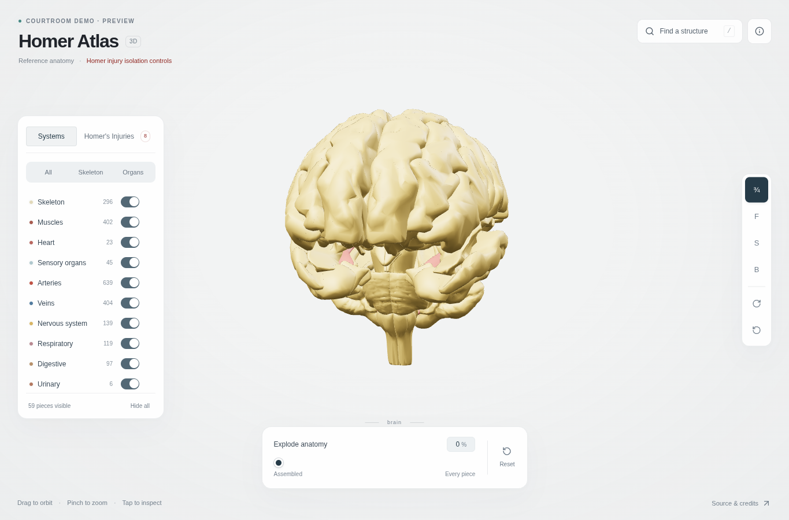
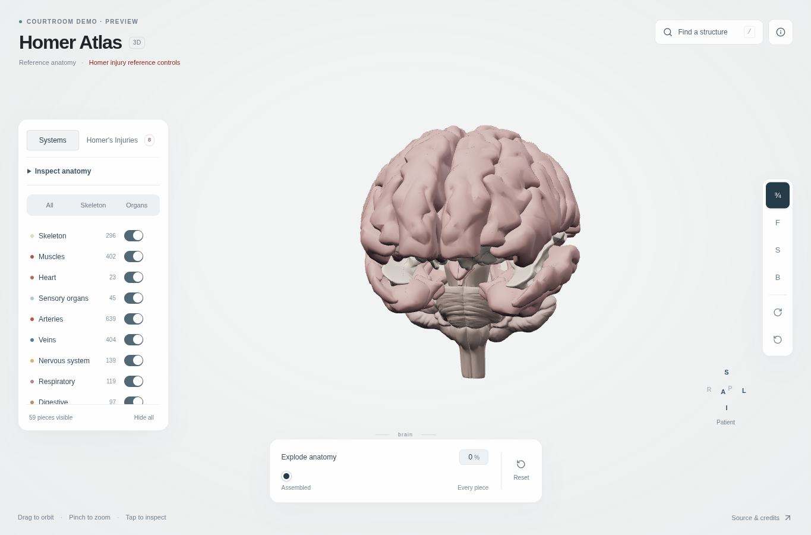
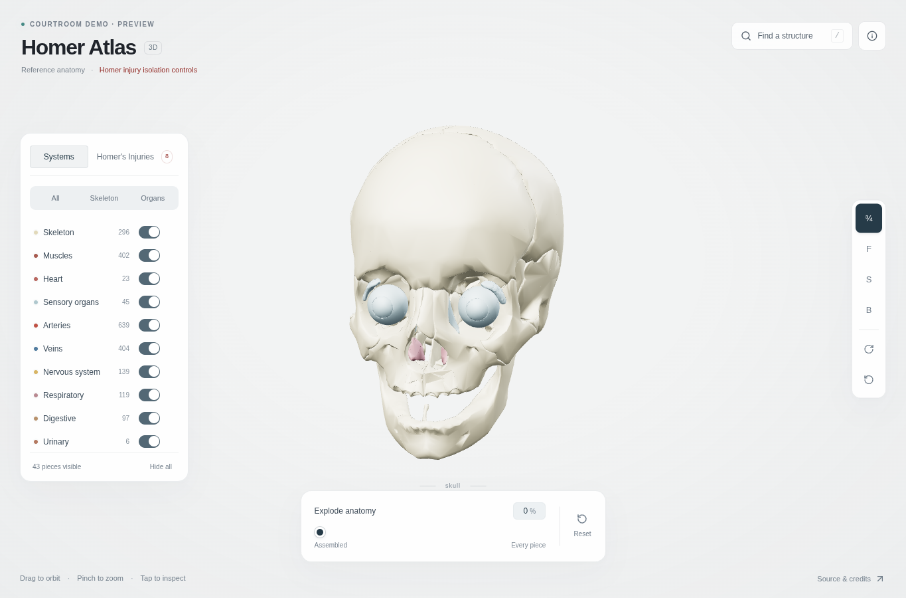
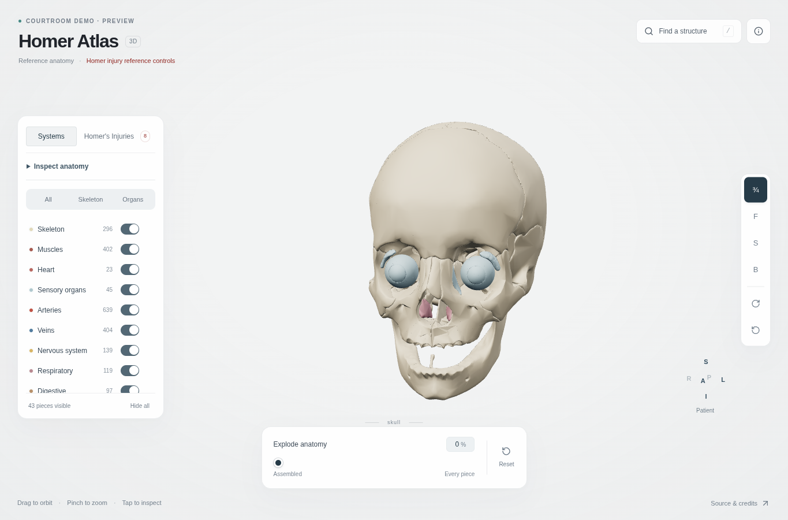
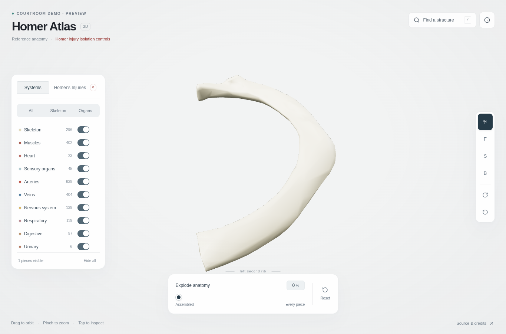
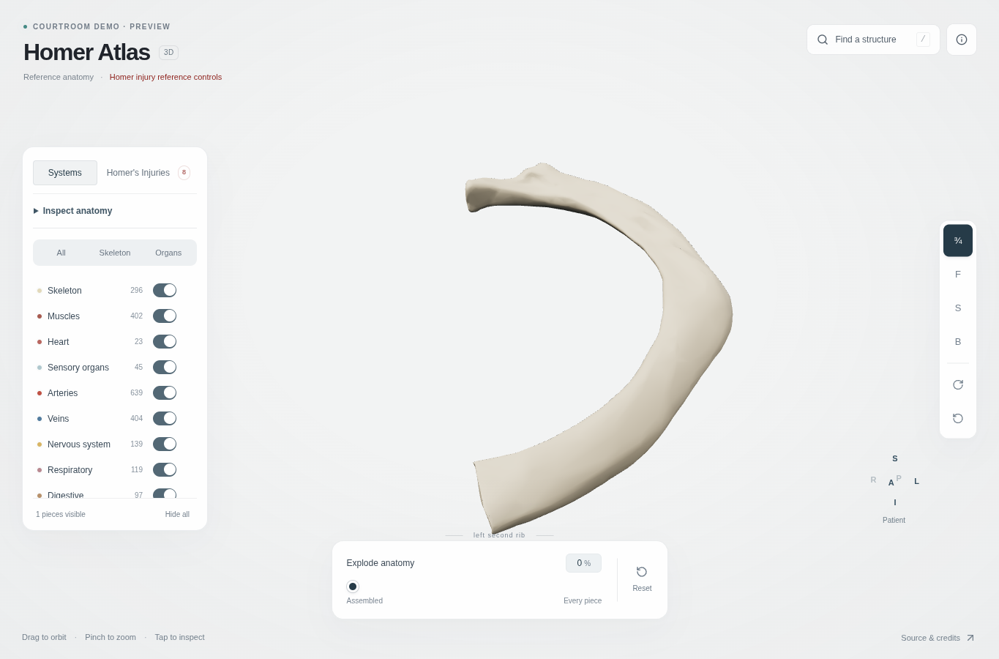
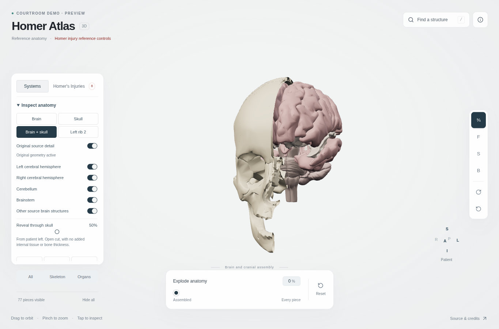

# Integrated anatomy milestone

Review branch: `refine/integrated-anatomy-milestone`, based on main `0ccd3c7f6fc721c45c70cbbb04ba788770555087`. [Pull request #5](https://github.com/raygalvan/human-atlas/pull/5). No merge or production publication is part of this work. No changes were made to `raygalvan/homer`, Law.bot, authentication, databases, or evidence files.

## Inspect the result

Open **Systems → Inspect anatomy** and select **Brain**, **Skull**, **Brain + skull**, or **Left rib 2**. These are the existing atlas meshes in their original registration. Use the source-detail switch to compare geometry, the named brain component switches to expose source structures, and **Restore atlas** to return to the assembled body. Existing search, picking, isolation, system controls, desktop camera/explosion controls, and Homer reference groups remain available.

The relationship view includes an uncapped, patient-left-to-right skull reveal. This discards existing surface fragments; it does not construct internal tissue, thickness, or a fracture. The patient compass follows the camera; left/right view buttons refer to the patient. Mobile retains the small Layers button and touch orbit/zoom, with inspection options inside Layers.

## Actual geometry changes

| Target | Stable identity | Source meshes | Base triangles | Refined triangles |
|---|---|---:|---:|---:|
| Brain | FMA50801 | 59 | 141,458 | 322,262 |
| Cranial/facial assembly | Skeletal members of FMA46565, excluding hyoids | 18 | 53,306 | 124,300 |
| Left second rib | FMA8012 / FJ3229 | 1 | 1,230 | 5,594 |
| Total | Explicit source-ID mapping in detail.json | 78 | 195,994 | 452,156 |

The 78 replacements retain geometry from the attributed BodyParts3D archive before the app's additional simplification. There is no subdivision, smoothing pass, procedural noise, replacement texture plane, or normal map. The optional pack is 5,859,671 compressed bytes in 44 chunks; only selected inspection structures load. The entire body's resolution has not been increased.

The original `atlas.json` and all base body buffers are unchanged. Each replacement carries its original source ID, name, concept ID and system, plus source-file and topology SHA-256 hashes. The reproducible packer regenerates offsets, counts, bounds, alignment, gzip and metadata together. Rebuilding from the downloaded archive produced byte-identical outputs. Actual bounds agree with base geometry within 0.0000002 m; the runtime also checks identity, registration and buffer bounds before activating detail.

The existing converter maps source `(x,y,z)` millimeters to `(x/1000, z/1000+0.0781112, -y/1000-0.1)` meters: **+X patient left, +Y superior, +Z anterior**. The named left second rib lies entirely at positive X; its right counterpart is entirely negative X. Laterality was established from converter and named structures, independently of camera position.

Base normals were already unit length (sample range approximately 0.99998–1.00002). Representative source face winding agreed with vertex normals: left superior frontal gyrus FJ1833, frontal bone FJ3200 and left second rib FJ3229. Source meshes contain open boundaries and component seams; these were preserved. The `_obj_99` archive is itself polygon-reduced reference anatomy, not raw MRI or an unlimited-resolution original. Its large inter-component gaps and angular areas remain limitations.

## Rendering and integration

Muted pink/gray brain tissue, differentiated existing white matter/cerebellar/brainstem structures, warm ivory bone, reduced gloss and balanced lighting improve shape readability. These are shading changes, separate from the triangle-count increases above. Selection uses a subtle cool edge; isolation retains anatomical colors. Whole organs and bones are no longer painted red as if each were a localized finding.

Source-defined hemisphere, cerebellum and brainstem controls partition the 59 existing brain meshes. No anatomical subdivisions were invented. The broader source skull concept contains eyes and hyoids; its original membership remains intact. The new Skull inspection deliberately selects 18 cranial/facial bones. Search for the original skull concept still selects the source's broader 43-piece group.

Detail replaces the original geometry inside the same chunk/system batches. Only affected batches are rebuilt; invisible batches are skipped. The picker and bounds use the identical active geometry. Old and refined surfaces are never drawn together. GPU per-part translations, original concept/system membership and assembly placement remain intact. Restoring the assembly restores base display geometry. Missing optional catalogue/chunks leave working base anatomy available.

## Reference anatomy and evidence

No authoritative Medical Examiner report with identifiable page citations is present in this checkout. The eight inherited Homer groups remain accessible but are explicitly **unverified anatomical reference groups**. Their old IDs and resolver memberships are retained for compatibility; inherited rib levels, laterality and locations are not accepted as findings. There are zero verified injury records and no real lesion, fracture line, dimension or causal conclusion added.

`app/injury-attachments.ts` defines stable target identity, laterality, supported region, evidence citation and evidence review separately from placement method and placement review. A triangle attachment requires an exact topology hash. A reference-space surface mask requires exact source registration.

The explicit developer URL `?developer=registration` exposes a disabled-by-default **Synthetic registration patch** in Inspect anatomy. It is blue and labeled as a synthetic registration test on a named source structure. The shader evaluates interpolated parent surface position and normal before the atlas's GPU translations. It therefore follows the parent during orbit, zoom, isolation, explosion and detail changes; parent visibility and clipping also apply. It is not a free-floating mesh, screen circle, or Homer finding. The fixture anchor comes from base geometry and remains fixed when the original-detail topology is substituted.

## Before and after

Both sets are actual Chromium captures of the integrated atlas, at 1365 × 900, using the same search/isolate workflow and three-quarter view. Camera placement also changed to account for the usable viewport, so these are comparable views, not pixel-aligned image differences. Full original concepts are selected here, including the broader source skull group.

| Brain before | Brain after |
|---|---|
|  |  |

| Skull before | Skull after |
|---|---|
|  |  |

| Left second rib before | Left second rib after |
|---|---|
|  |  |

[Brain six-angle contact sheet](brain-six-views.png), [cranial assembly six-angle contact sheet](skull-six-views.png), [left second rib six-angle contact sheet](rib-six-views.png).

## Verification and performance

Local validation passed with Node 24.19.0: TypeScript, atlas buffers/concepts, interaction/explosion layout, inherited injury resolver, nested asset paths, removal of the active flat Body Surface feature, preservation of ordinary skin/mobile styles, all original-detail geometry/hashes/laterality/attachment contracts, and production build. CI uses Node 22 and Playwright 1.55.1.

Browser evidence is generated by `scripts/check-atlas-browser.mjs` and `scripts/check-refinement-browser.mjs` against the production build served at `/courtroom-atlas/`. Acceptance uses Chromium 140 (SwiftShader) and WebKit 26 on GitHub Actions Linux. Viewports are desktop 1365 × 900, reduced phone portrait 390 × 600, and phone landscape 844 × 390. Chromium mobile input uses emulated touch orbit and two-finger pinch; WebKit uses a touch-capable viewport with mouse-driven orbit. This is not a physical-iPhone test.

Browser acceptance and paired performance results are being completed; the final PR update records the completed runs and limitations. Screenshots are visually inspected; the scripts also check shader errors, real rendered changes, canvas picking, repeated tab transitions, reveal/restoration, hidden parent behavior, source-detail swaps, missing optional assets and nested requests. The developer sequence produces an actual browser recording.

Initial single-run load observations were 5,491 ms on baseline and 4,149 ms on the refined build. These occurred on separate CI runners and do not establish a speedup. Refined isolated brain rendering submitted 6 draw calls / 381,576 triangles; the original batching code submitted 69 batches even when their members were hidden. Submitted triangles include hidden members within a visible batch. Renderer `renderMs` measures JavaScript submission time, not GPU completion or FPS.

The local preview server started, but this environment's browser rejected both loopback and the documented preview URL. Accordingly, the inspectable browser evidence comes from CI; neither these screenshots nor a build artifact is a live deployment. Production publication remains a separate reviewed action at the existing courtroom URL.

## Sources and license

- [Official BodyParts3D source archive](https://dbarchive.biosciencedbc.jp/data/bodyparts3d/LATEST/isa_BP3D_4.0_obj_99.zip).
- [Current official redistribution/adaptation terms](https://dbarchive.biosciencedbc.jp/en/bodyparts3d/lic.html), updated February 27, 2025: CC BY 4.0. The current terms supersede the legacy BY-SA comments in OBJ files.
- [CC BY 4.0](https://creativecommons.org/licenses/by/4.0/) and [repository attribution](../../public/ATTRIBUTION.md).
- The requested [BodyParts3D rotating reference](https://lifesciencedb.jp/bp3d/icon.cgi?i=BP51782&s=S&p=rotate) was inspected as a visual reference. The requested [Astra viewer](https://app.astra-ai.co/en-US/lab/human-body-3d) displayed a WebGL-unavailable notice in the available browser, so its anatomical rendering could not be assessed. Neither reference supplied a substitute display asset.

BodyParts3D, © The Database Center for Life Science licensed under CC Attribution 4.0 International. Derived geometry and anatomical screenshots retain this attribution. Original application code remains MIT.
